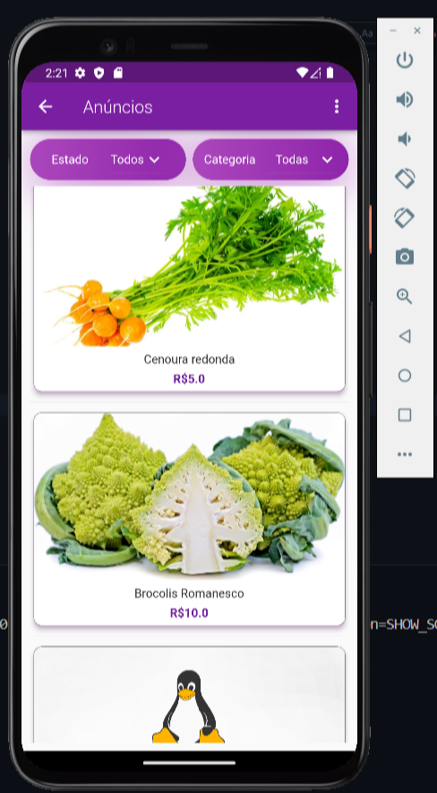
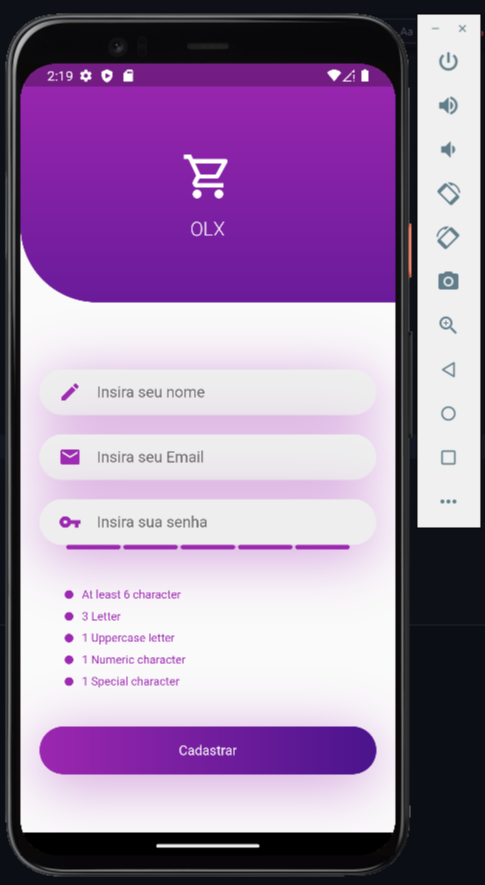
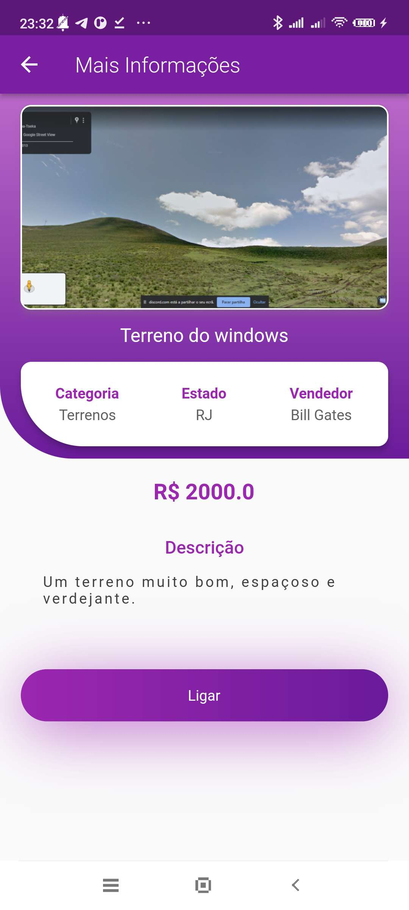
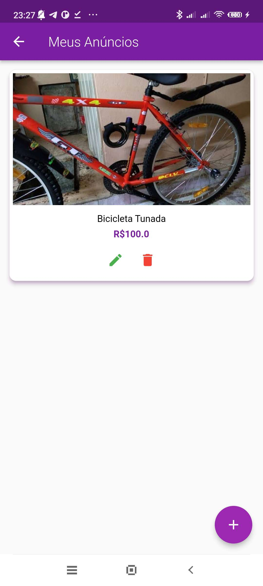
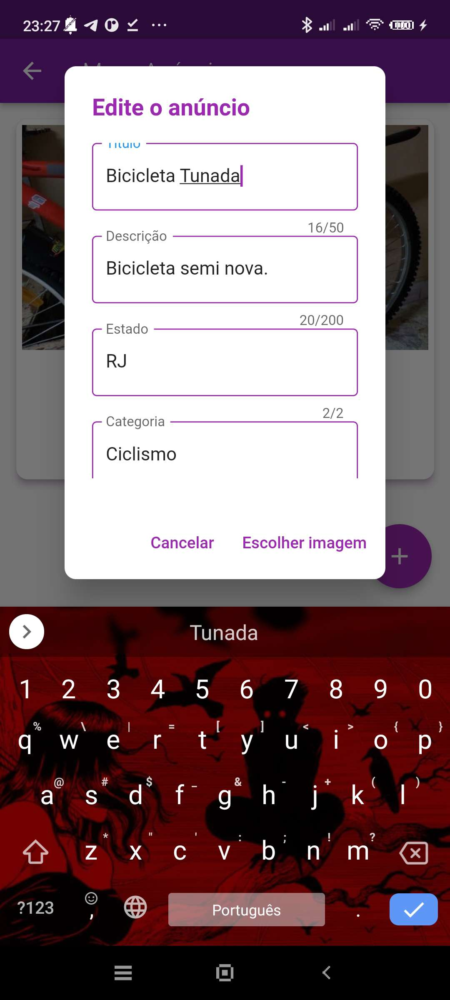

# App Comércio Eletrônico

Este repositório contém o projeto final da disciplina de Laboratório de Dispositivos Móveis, um aplicativo de **Loja de Anúncios** desenvolvido em Dart junto ao Flutter. O app permite que usuários cadastrados criem, editem, removam e pesquisem anúncios por categoria e região.

## Funcionalidades

### Acesso ao sistema
- Tela inicial com opções:
  - **Login** 
  - **Cadastro** 
  - **Acesso como visitante** (apenas para visualizar anúncios)
- Usuários logados podem criar e gerenciar seus próprios anúncios.
- Usuários não logados podem apenas visualizar anúncios, aplicando filtros de pesquisa.

### Pesquisa de Anúncios
- Listagem de anúncios com **filtros**:
  - Estado (UF)
  - Categoria
- Exibição dos detalhes de cada anúncio.

### Gestão de Anúncios (para usuários logados)
- **Meus Anúncios**: lista de anúncios criados pelo usuário.
- **Criar Anúncio**: formulário para adicionar um novo anúncio.
- **Editar Anúncio**: opção para modificar um anúncio existente.
- **Excluir Anúncio**: opção para remover anúncios indesejados.

## Banco de Dados SQLite
O aplicativo utiliza **SQLite** para armazenar usuários e anúncios localmente. As tabelas utilizadas são:

### Tabela `user`
Armazena informações dos usuários registrados.
- `id`: Identificador único do usuário.
- `name`: Nome do usuário.
- `email`: Endereço de e-mail do usuário.
- `password`: Senha do usuário.

### Tabela `advertisement`
Armazena os anúncios cadastrados no sistema.
- `id`: Identificador único do anúncio.
- `state`: Estado onde o anúncio se aplica.
- `category`: Categoria do anúncio.
- `title`: Título do anúncio.
- `price`: Preço do item ou serviço anunciado.
- `telephone`: Telefone de contato do anunciante.
- `description`: Descrição do anúncio.
- `photo`: Imagem associada ao anúncio.

## Imagens do Aplicativo

## Colaboradores

- Raphael Carvalho
- Rute Rodrigues
